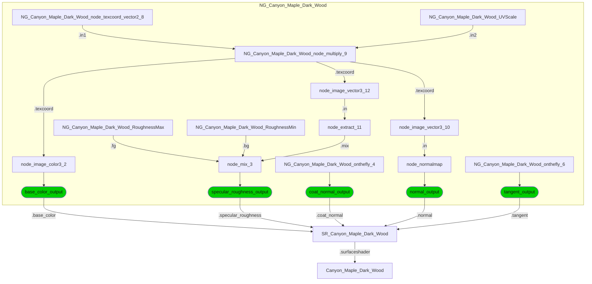

```mermaid
graph TD; 
    SR_Canyon_Maple_Dark_Wood[SR_Canyon_Maple_Dark_Wood] --".surfaceshader"--> Canyon_Maple_Dark_Wood[Canyon_Maple_Dark_Wood]
    NG_Canyon_Maple_Dark_Wood_node_image_color3_2[NG_Canyon_Maple_Dark_Wood_node_image_color3_2] --> NG_Canyon_Maple_Dark_Wood_NG_Canyon_Maple_Dark_Wood_node_image_color3_2base_color_output([base_color_output])
    style NG_Canyon_Maple_Dark_Wood_NG_Canyon_Maple_Dark_Wood_node_image_color3_2base_color_output fill:#0C0, color:#111
    NG_Canyon_Maple_Dark_Wood_NG_Canyon_Maple_Dark_Wood_node_image_color3_2base_color_output --".base_color"--> SR_Canyon_Maple_Dark_Wood[SR_Canyon_Maple_Dark_Wood]
    NG_Canyon_Maple_Dark_Wood_node_multiply_9[NG_Canyon_Maple_Dark_Wood_node_multiply_9] --".texcoord"--> NG_Canyon_Maple_Dark_Wood_node_image_color3_2[node_image_color3_2]
    NG_Canyon_Maple_Dark_Wood_node_texcoord_vector2_8[NG_Canyon_Maple_Dark_Wood_node_texcoord_vector2_8] --".in1"--> NG_Canyon_Maple_Dark_Wood_node_multiply_9[node_multiply_9]
    NG_Canyon_Maple_Dark_Wood_UVScale[NG_Canyon_Maple_Dark_Wood_UVScale] --".in2"--> NG_Canyon_Maple_Dark_Wood_node_multiply_9[node_multiply_9]
    NG_Canyon_Maple_Dark_Wood_node_mix_3[NG_Canyon_Maple_Dark_Wood_node_mix_3] --> NG_Canyon_Maple_Dark_Wood_NG_Canyon_Maple_Dark_Wood_node_mix_3specular_roughness_output([specular_roughness_output])
    style NG_Canyon_Maple_Dark_Wood_NG_Canyon_Maple_Dark_Wood_node_mix_3specular_roughness_output fill:#0C0, color:#111
    NG_Canyon_Maple_Dark_Wood_NG_Canyon_Maple_Dark_Wood_node_mix_3specular_roughness_output --".specular_roughness"--> SR_Canyon_Maple_Dark_Wood[SR_Canyon_Maple_Dark_Wood]
    NG_Canyon_Maple_Dark_Wood_RoughnessMax[NG_Canyon_Maple_Dark_Wood_RoughnessMax] --".fg"--> NG_Canyon_Maple_Dark_Wood_node_mix_3[node_mix_3]
    NG_Canyon_Maple_Dark_Wood_RoughnessMin[NG_Canyon_Maple_Dark_Wood_RoughnessMin] --".bg"--> NG_Canyon_Maple_Dark_Wood_node_mix_3[node_mix_3]
    NG_Canyon_Maple_Dark_Wood_node_extract_11[NG_Canyon_Maple_Dark_Wood_node_extract_11] --".mix"--> NG_Canyon_Maple_Dark_Wood_node_mix_3[node_mix_3]
    NG_Canyon_Maple_Dark_Wood_node_image_vector3_12[NG_Canyon_Maple_Dark_Wood_node_image_vector3_12] --".in"--> NG_Canyon_Maple_Dark_Wood_node_extract_11[node_extract_11]
    NG_Canyon_Maple_Dark_Wood_node_multiply_9[NG_Canyon_Maple_Dark_Wood_node_multiply_9] --".texcoord"--> NG_Canyon_Maple_Dark_Wood_node_image_vector3_12[node_image_vector3_12]
    NG_Canyon_Maple_Dark_Wood_onthefly_4[NG_Canyon_Maple_Dark_Wood_onthefly_4] --> NG_Canyon_Maple_Dark_Wood_NG_Canyon_Maple_Dark_Wood_onthefly_4coat_normal_output([coat_normal_output])
    style NG_Canyon_Maple_Dark_Wood_NG_Canyon_Maple_Dark_Wood_onthefly_4coat_normal_output fill:#0C0, color:#111
    NG_Canyon_Maple_Dark_Wood_NG_Canyon_Maple_Dark_Wood_onthefly_4coat_normal_output --".coat_normal"--> SR_Canyon_Maple_Dark_Wood[SR_Canyon_Maple_Dark_Wood]
    NG_Canyon_Maple_Dark_Wood_node_normalmap[NG_Canyon_Maple_Dark_Wood_node_normalmap] --> NG_Canyon_Maple_Dark_Wood_NG_Canyon_Maple_Dark_Wood_node_normalmapnormal_output([normal_output])
    style NG_Canyon_Maple_Dark_Wood_NG_Canyon_Maple_Dark_Wood_node_normalmapnormal_output fill:#0C0, color:#111
    NG_Canyon_Maple_Dark_Wood_NG_Canyon_Maple_Dark_Wood_node_normalmapnormal_output --".normal"--> SR_Canyon_Maple_Dark_Wood[SR_Canyon_Maple_Dark_Wood]
    NG_Canyon_Maple_Dark_Wood_node_image_vector3_10[NG_Canyon_Maple_Dark_Wood_node_image_vector3_10] --".in"--> NG_Canyon_Maple_Dark_Wood_node_normalmap[node_normalmap]
    NG_Canyon_Maple_Dark_Wood_node_multiply_9[NG_Canyon_Maple_Dark_Wood_node_multiply_9] --".texcoord"--> NG_Canyon_Maple_Dark_Wood_node_image_vector3_10[node_image_vector3_10]
    NG_Canyon_Maple_Dark_Wood_onthefly_6[NG_Canyon_Maple_Dark_Wood_onthefly_6] --> NG_Canyon_Maple_Dark_Wood_NG_Canyon_Maple_Dark_Wood_onthefly_6tangent_output([tangent_output])
    style NG_Canyon_Maple_Dark_Wood_NG_Canyon_Maple_Dark_Wood_onthefly_6tangent_output fill:#0C0, color:#111
    NG_Canyon_Maple_Dark_Wood_NG_Canyon_Maple_Dark_Wood_onthefly_6tangent_output --".tangent"--> SR_Canyon_Maple_Dark_Wood[SR_Canyon_Maple_Dark_Wood]
  subgraph NG_Canyon_Maple_Dark_Wood
    NG_Canyon_Maple_Dark_Wood_NG_Canyon_Maple_Dark_Wood_node_image_color3_2base_color_output
    NG_Canyon_Maple_Dark_Wood_NG_Canyon_Maple_Dark_Wood_node_mix_3specular_roughness_output
    NG_Canyon_Maple_Dark_Wood_NG_Canyon_Maple_Dark_Wood_node_normalmapnormal_output
    NG_Canyon_Maple_Dark_Wood_NG_Canyon_Maple_Dark_Wood_onthefly_4coat_normal_output
    NG_Canyon_Maple_Dark_Wood_NG_Canyon_Maple_Dark_Wood_onthefly_6tangent_output
    NG_Canyon_Maple_Dark_Wood_RoughnessMax
    NG_Canyon_Maple_Dark_Wood_RoughnessMin
    NG_Canyon_Maple_Dark_Wood_UVScale
    NG_Canyon_Maple_Dark_Wood_node_extract_11
    NG_Canyon_Maple_Dark_Wood_node_image_color3_2
    NG_Canyon_Maple_Dark_Wood_node_image_vector3_10
    NG_Canyon_Maple_Dark_Wood_node_image_vector3_12
    NG_Canyon_Maple_Dark_Wood_node_mix_3
    NG_Canyon_Maple_Dark_Wood_node_multiply_9
    NG_Canyon_Maple_Dark_Wood_node_normalmap
    NG_Canyon_Maple_Dark_Wood_node_texcoord_vector2_8
    NG_Canyon_Maple_Dark_Wood_onthefly_4
    NG_Canyon_Maple_Dark_Wood_onthefly_6
  end

```
